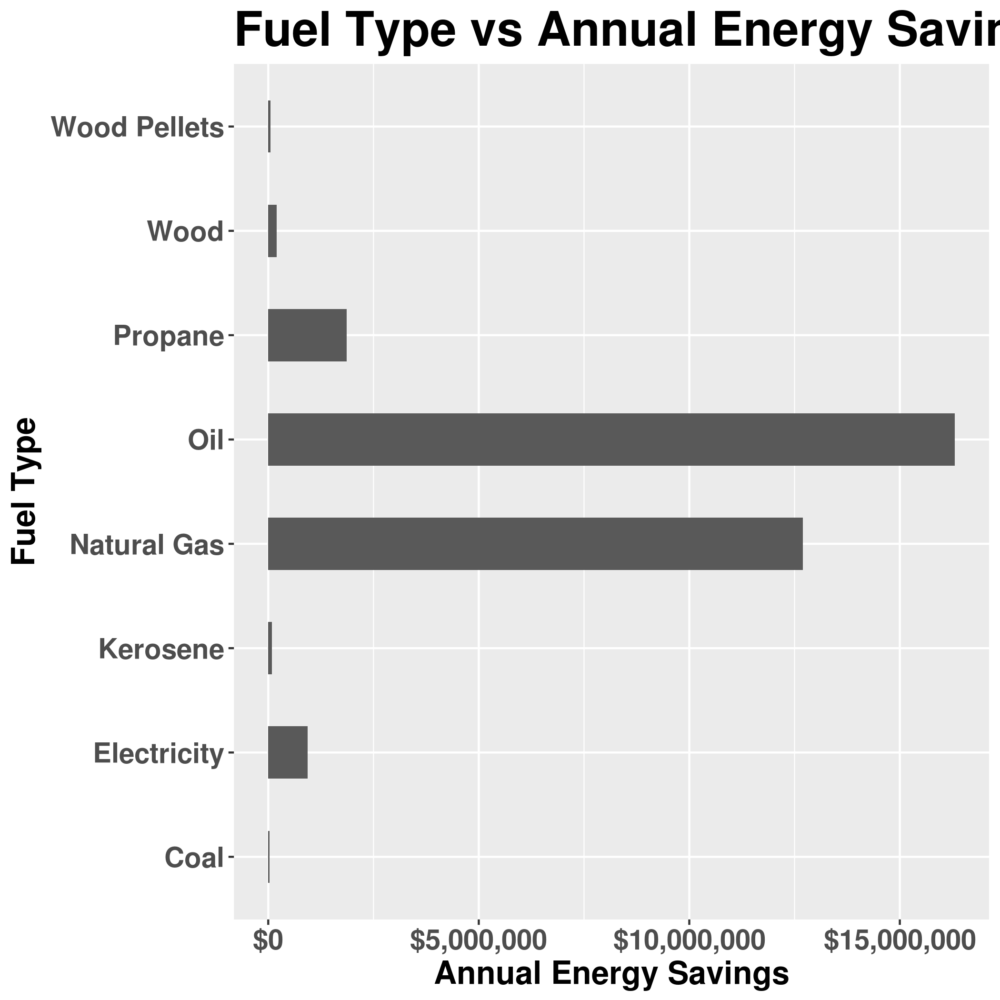
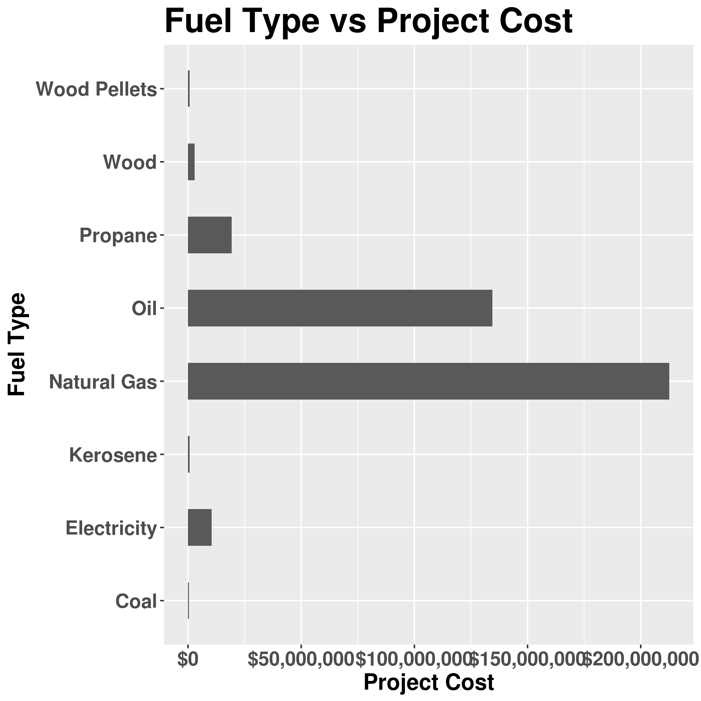
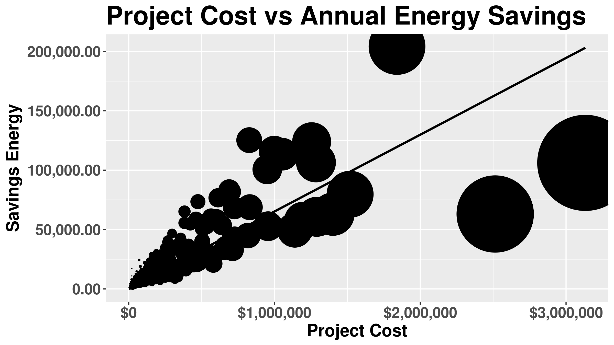

Welcome to the Analysis of New York State's Energy Star® Program
========================================================
author: Nikhil Kalyankar
date: Jun 19, 2017
autosize: true
width: 1920
height: 1080

Introduction
========================================================
The One- to Four-Family Home Performance with ENERGY STAR® Program is a market transformation program that uses Building Performance Institute (BPI) Goldstar contractors to install comprehensive energy-efficient improvements. The program is designed to use building science and a whole-house approach to reduce energy use in the New York State’s existing one-to-four family and low-rise multifamily residential buildings and capture heating fuel and electricity-related savings. 

This project is divided in to four phases:

- Data Preview
- Exploratory Graphs
- Linear Regression Analysis and related graphs
- Geospatial Overview

For more details please visit <https://kalyankar.shinyapps.io/energy-star/>.

Data and information source for this project <https://data.ny.gov/api/views/assk-vu73/rows.json?accessType=DOWNLOAD>


Data Preview
========================================================
Selected columns


```r
library(dplyr)
str(tbl_df(data))
```

```
Classes 'tbl_df', 'tbl' and 'data.frame':	12621 obs. of  14 variables:
 $ location             : Factor w/ 1637 levels "","Accord, NY 12404\n(41.820279, -74.237173)",..: 2 2 2 2 2 2 2 2 2 2 ...
 $ gas_utility          : Factor w/ 16 levels "Unknown Gas Provider",..: 1 1 1 1 1 1 1 1 1 1 ...
 $ electric_utility     : Factor w/ 8 levels "Central Hudson Gas & Electric",..: 1 1 1 1 1 1 1 1 1 1 ...
 $ customer_type        : Factor w/ 2 levels "Assisted","Market": 1 1 1 1 2 2 2 2 2 2 ...
 $ performance_indicator: Factor w/ 2 levels "1-4 Family Home Performance Program",..: 1 1 1 1 1 1 1 1 1 1 ...
 $ type_of_financing    : Factor w/ 5 levels "","ESMART","ESTAR",..: 1 1 1 4 1 1 4 4 4 5 ...
 $ fuel_type            : Factor w/ 8 levels "Coal","Electricity",..: 5 5 6 5 5 5 2 5 6 5 ...
 $ audit                : Factor w/ 2 levels "No","Yes": 1 2 2 2 1 2 2 2 2 2 ...
 $ project_cost         : num  5417 7056 5131 15077 17634 ...
 $ incentives           : num  2708 3528 2566 4500 1608 ...
 $ amount_financed      : num  0 0 0 10577 0 ...
 $ savings_kwh          : int  0 0 1005 -26 1185 161 2700 150 0 0 ...
 $ savings_mmbtu        : num  42.9 20.9 12.8 45.1 62.7 ...
 $ savings_energy       : num  1058 570 637 1262 1874 ...
```

Exploratory Graphs
========================================================
The relation of factors viz-a-viz the predictor and outcome columns



Linear Regression Analysis and related graphs
========================================================

```r
fit <- lm(data = data, formula = savings_energy ~ project_cost)
summary <- coef(summary(fit))
paste("Intercept: ",summary[1][1], "Slope: ",summary[2][1])
```

```
[1] "Intercept:  594.462838676323 Slope:  0.0646473435049348"
```


